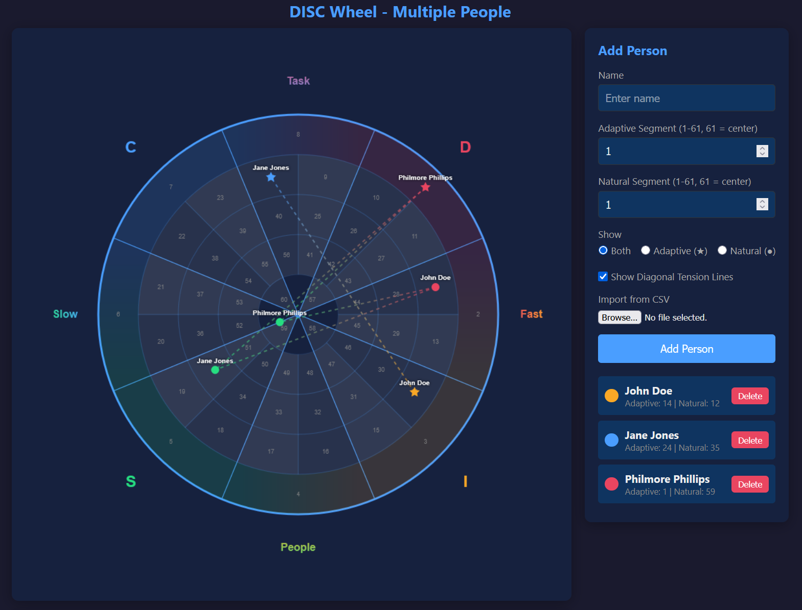
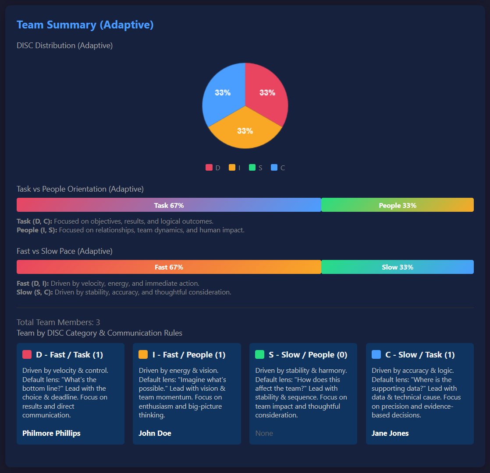

# DISC Wheel Dashboard

A visual dashboard for analyzing executive team composition using the DISC assessment framework, designed to support communication workshops and team development initiatives.

## Dashboard Intent

This dashboard was created to facilitate executive communication workshops focused on **Pacing** (Fast vs. Slow) and **Orientation** (Task vs. People). It helps teams:

- Visualize team composition across DISC quadrants
- Identify communication gaps and friction points
- Understand diagonal tension between opposing styles (D↔S, I↔C)
- Learn quadrant-specific communication approaches
- Compare Adaptive (work) vs. Natural (innate) DISC profiles

## Features

- **Interactive DISC Wheel** with team member positioning
- **Diagonal Tension Visualizer** - Shows lines connecting opposing quadrants with gradient colors
- **Team Summary (Adaptive)** - DISC distribution, orientation/pace analysis, and team categorization
- **Team Summary (Natural)** - Same analysis for natural DISC profiles (toggleable)
- **Communication Approach Descriptions** - Detailed guidance for each quadrant
- **CSV Import** - Easily load team data from external files
- **Dual Display Modes** - Show Adaptive, Natural, or both on the wheel

## Screenshots

### DISC Wheel Visualization


### Team Summary Dashboard


## CSV Format

To import team data, create a CSV file with the following format:

```csv
name,adaptiveSegment,naturalSegment
John Doe,21,42
Jane Smith,47,3
Bob Johnson,15,61
```

**Column Descriptions:**
- `name`: Person's name
- `adaptiveSegment`: DISC segment number for Adaptive profile (1-61, where 61 = center)
- `naturalSegment`: DISC segment number for Natural profile (1-61, where 61 = center)

**DISC Segment Numbers:**
- Segments 1-8: Outer ring
- Segments 9-24: Ring 1
- Segments 25-40: Ring 2  
- Segments 41-56: Ring 3
- Segments 57-60: Inner ring
- Segment 61: Center (Neutral)

## How to Use

1. **Open the Dashboard**: Simply open `index.html` in a web browser (no server required)

2. **Import Team Data**: 
   - Click "Choose File" in the controls panel
   - Select your CSV file
   - The dashboard will automatically update with imported data

3. **Add Individuals Manually**:
   - Enter name, Adaptive segment, and Natural segment
   - Click "Add Person"
   - The person will appear on the wheel and in team summaries

4. **Toggle Display Options**:
   - Show/Hide Diagonal Tension Lines
   - Filter by Adaptive, Natural, or Both
   - Show/Hide Natural Team Summary

5. **Hover for Details**: Hover over any person on the wheel to highlight them

## Communication Framework

The dashboard is built around two primary axes:

### Pacing (Fast vs. Slow)
- **Fast (D, I)**: Driven by velocity, energy, and immediate action
- **Slow (S, C)**: Driven by stability, accuracy, and thoughtful consideration

### Orientation (Task vs. People)
- **Task (D, C)**: Focused on objectives, results, and logical outcomes
- **People (I, S)**: Focused on relationships, team dynamics, and human impact

### Quadrant Approaches

- **D (Fast/Task)**: Lead with the choice & deadline. Give them the bottom line immediately.
- **I (Fast/People)**: Lead with vision & team momentum. Start with the big picture idea.
- **S (Slow/People)**: Lead with stability & sequence. Give context before asking for decisions.
- **C (Slow/Task)**: Lead with data & technical cause. Send supporting data beforehand.

## Workshop Support

This dashboard supports a 30-minute executive DISC workshop covering:

1. **The Two Axes of Friction** - Understanding pacing and orientation
2. **Team Topology & Diagonal Tension** - Visualizing team composition
3. **4-Quadrant Language Shift** - Learning quadrant-specific communication
4. **Diagonal Bridge Exercise** - Practice adapting communication styles
5. **Team "Cheat Codes"** - Individual communication preferences

## Technical Details

- **Single-file HTML** - No external dependencies or server required
- **Canvas-based visualization** - Smooth, interactive wheel rendering
- **Responsive design** - Works on various screen sizes
- **Local file processing** - CSV import uses FileReader API (no server needed)

## File Structure

```
disc-wheel/
├── index.html          # Main dashboard file
├── people.csv          # Sample team data (not tracked in git)
├── .gitignore          # Excludes CSV files
└── README.md           # This file
```

## Notes

- CSV files are excluded from version control via `.gitignore` to protect team member privacy
- The dashboard works entirely client-side - no data is sent to external servers
- Segment numbers should correspond to standard DISC wheel positioning
